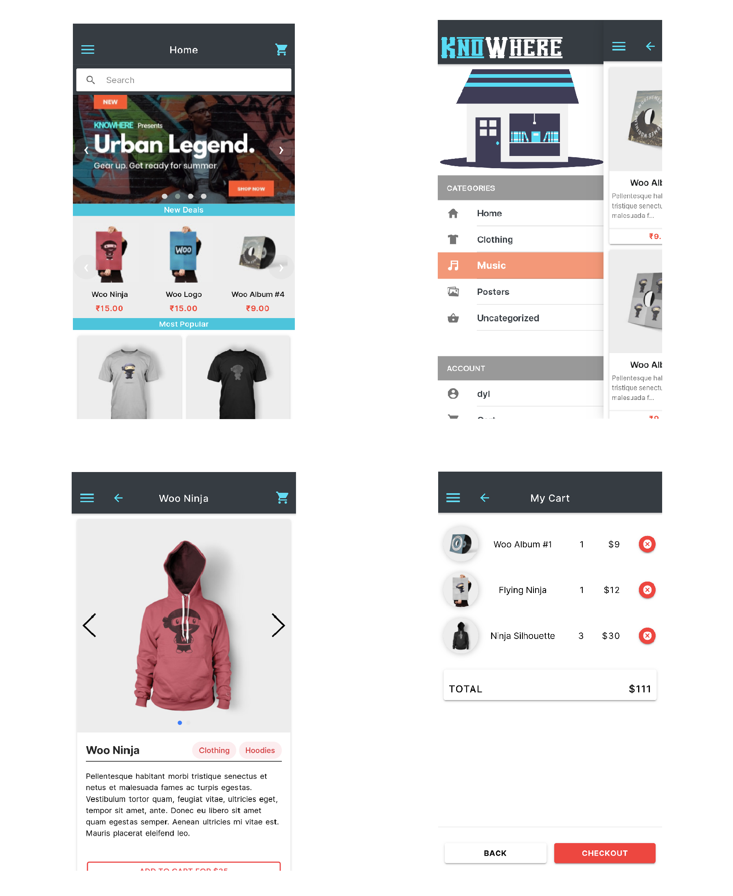

<h1 align="center">KnoWhere E-Commerce App</h1>

KnoWhere was built using Ionic v4 and Angular 8. On the backend, it makes use of Wordpress with Woo-commerce. Please try it out using the Play Store link at the bottom, which is an Android App Bundle (.aab) and optimized to be have a smaller download size depending on your device or if you prefer the .apk file, you can download that too from the link below.

## Screenshots

## Features

- Progressive Image Loading
- Service Worker
- Paypal integrated
- Push Notifications
- Retry requests on failure
- Product Search
- Detect device's Internet Status
- & More

## Tools used

- HTML5
- SASS
- Angular 8
- Ionic 4
- Wordpress 5.4
- Node.js

## Try it out

- Play Store Link (Review Pending)
- [APK file](https://github.com/iamdylan/knoWhere-ecommerce-app-using-ionic/raw/master/Play_Store_Assets/Builds/KnoWhere.apk)
